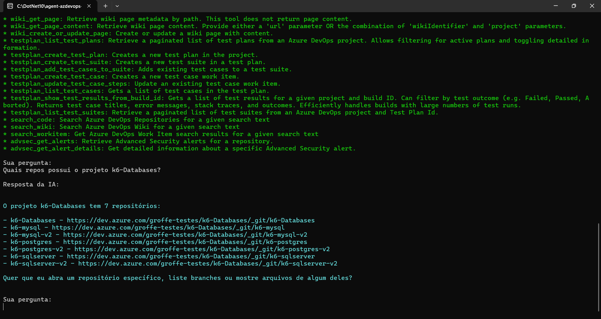
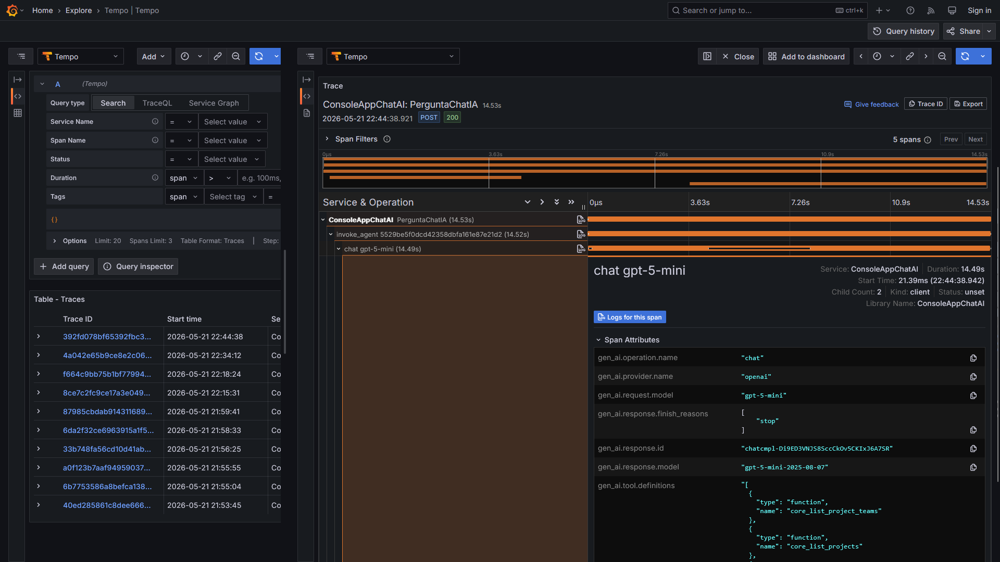

# dotnet10-agent-framework-azuredevops-mcp-otel-grafana_chat
Exemplo em .NET 10 de Console Application que faz uso do Microsoft Agent Framework, com integração com o Microsoft Foundry como solução de IA Generativa na interação via chat com uma Organization do Azure DevOps. Inclui o uso do MCP oficial do Azure DevOps e observabilidade com Grafana + OpenTelemetry (via Docker Compose).

Exemplo de interação via chat:

Trace do Grafana Tempo:

